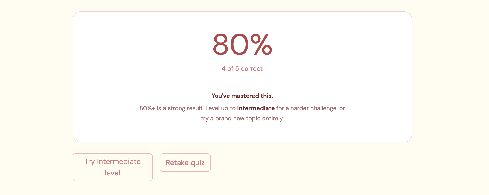

# 🎓 Personalized AI Tutor

> Generate structured lessons, take AI-powered quizzes, and get instant feedback — all tailored to your level.


---

## Overview

Personalized AI Tutor is a full-stack LLM application that turns any topic into a structured learning experience. Built with Groq's LLaMA 3.3-70b, it generates lessons calibrated to your skill level, quizzes you on the content, explains your mistakes factually, and adapts the difficulty based on your performance.

---

## ✨ Features

- **Adaptive Lessons** — Generates structured lessons across Beginner, Intermediate, and Advanced levels
- **MCQ Quiz Engine** — Auto-generates 5 contextual questions directly from lesson content
- **Real-time Explanations** — AI-powered answer feedback that explains what went wrong and why
- **Adaptive Difficulty** — Recommends leveling up or down based on quiz score
- **Clean UI** — Custom-themed Streamlit interface with session-based state management

---

## 🛠️ Tech Stack

| Layer | Technology |
|---|---|
| Language Model | LLaMA 3.3-70b-versatile via Groq API |
| Frontend | Streamlit |
| Prompt Engineering | Custom multi-prompt pipeline |
| Deployment | Streamlit Cloud |
| Language | Python 3 |

---

## 📸 Screenshots

### Lesson Generation


### Quiz Result



### Answer Explanations


---

## 🚀 Getting Started

**1. Clone the repo**
```bash
git clone https://github.com/NehaKadam26/personalized-ai-tutor.git
cd personalized-ai-tutor
```

**2. Install dependencies**
```bash
pip3 install -r requirements.txt
```

**3. Add your Groq API key**
```bash
echo "GROQ_API_KEY=your_key_here" > .env
```

**4. Run the app**
```bash
streamlit run app.py
```

---

## 🌐 Live Demo

**[personalized-ai-tutor-26.streamlit.app](https://personalized-ai-tutor-26.streamlit.app)**