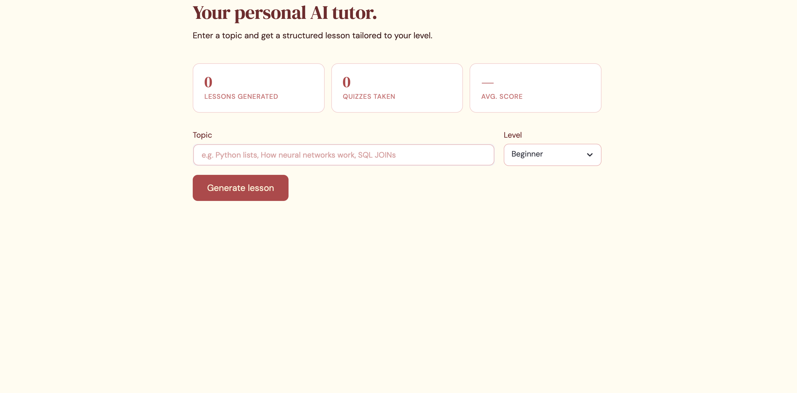
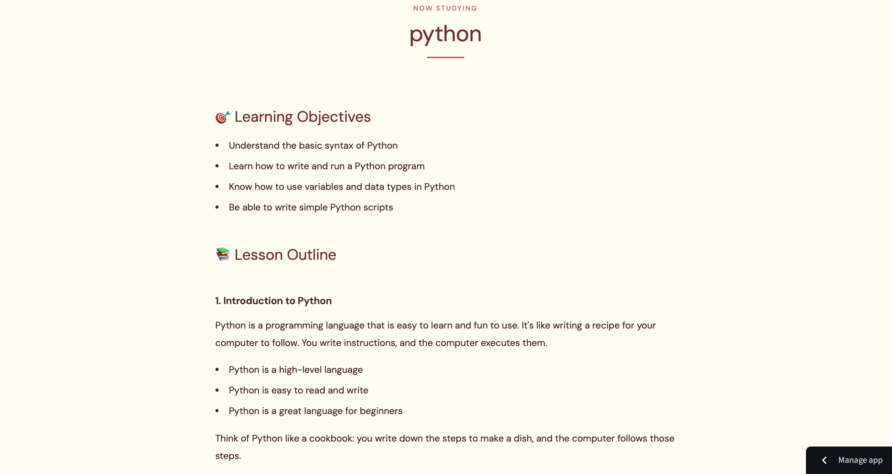
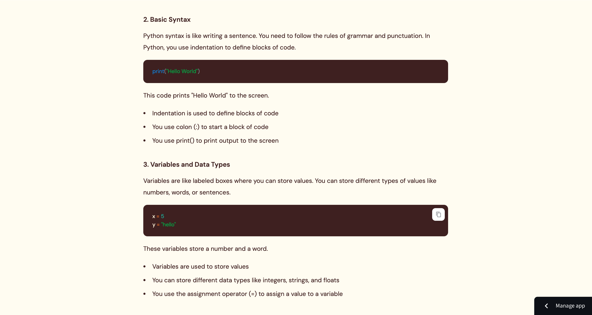
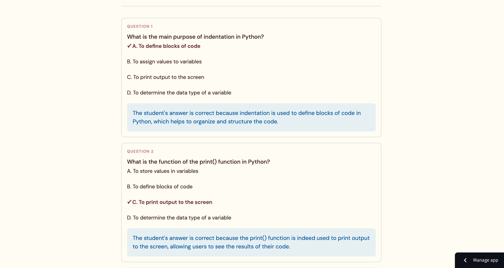

# 🎓 Personalized AI Tutor

An AI-powered tutoring app that generates structured lessons and MCQ quizzes on any topic, with adaptive difficulty based on quiz performance.



## ✨ Features
- Generate structured lessons tailored to Beginner, Intermediate, or Advanced level
- Auto-generated 5-question MCQ quiz from the lesson content
- Real-time answer explanations powered by LLaMA 3.3
- Adaptive difficulty — suggests easier or harder level based on your score

## 🛠️ Tech Stack
- Python
- Groq API (LLaMA 3.3-70b-versatile)
- Streamlit
- Prompt Engineering

## 📸 Screenshots








## 🚀 Setup

1. Clone the repo
```bash
git clone https://github.com/NehaKadam26/personalized-ai-tutor.git
cd personalized-ai-tutor
```

2. Install dependencies
```bash
pip3 install -r requirements.txt
```

3. Add your Groq API key
```bash
echo "GROQ_API_KEY=your_key_here" > .env
```

4. Run the app
```bash
streamlit run app.py
```

## 🌐 Live Demo
[personalized-ai-tutor-26.streamlit.app](https://personalized-ai-tutor-26.streamlit.app)